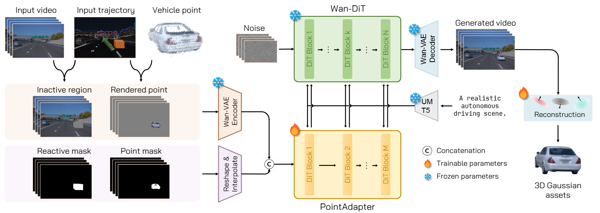

# DriveWeaver: Point-Conditioned Video Inpainting for Controllable Vehicle Insertion in Autonomous Driving Simulation

### [[Project]]() [[Paper]](https://arxiv.org/abs/2501.13971) 

> [**DriveWeaver: Point-Conditioned Video Inpainting for Controllable Vehicle Insertion in Autonomous Driving Simulation**](https://arxiv.org/abs/2501.13971),            
> [Junzhe Jiang](https://selfspin.github.io/), [Zipei Ma](https://xiao10ma.github.io/), [Zijie Pan](https://mdarhdarz.github.io/), [Li Zhang](https://lzrobots.github.io)<sup>✉</sup>      
> **ECCV 2026**

**Official implementation of "DriveWeaver: Point-Conditioned Video Inpainting for Controllable Vehicle Insertion in Autonomous Driving Simulation".** 

## 🛠️ Pipeline
<div align="center">
  
</div><br/>

## 🎞️ Demo
[](https://www.youtube.com/watch?v=tNcwNxUjzWE "DriveWeaver - YouTube")

## 📜 BibTeX
``` bibtex
@inproceedings{jiang2026driveweaver,
  title={DriveWeaver: Point-Conditioned Video Inpainting for Controllable Vehicle Insertion in Autonomous Driving Simulation},
  author={Jiang, Junzhe and Ma, Zipei and Pan, Zijie and Zhang, Li},
  booktitle={European Conference on Computer Vision (ECCV)},
  year={2026}
}
```